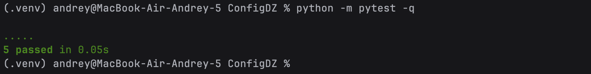

# ConfigManagementDZ
## Конфигурационное управление (Вариант 13)
### 1. Структура проекта
<pre>README.md
main.py
test_basic.py
db.conf
db.json
game.conf
game.json </pre>

### 2. Реализация
#### 2.1 Парсер
- использует LALR-парсер из библиотеки Lark
- построение AST через Transformer
#### 2.2 CLI
Запуск:
<pre>python main.py -i input.conf -o output.json</pre>

### 3. Тестирование
Запуск тестов с помощью testpy(файл test_basic.py):
<pre>python -m pytest -q</pre>

### 4. Примеры работы программы
#### 1. game.conf
Вход:game.conf
<pre>
  player_stats is struct {
    hp = 100.0,
    mp = 50.0
  }
  
  inventory is [ 1.0 2.0 3.0 ]
  
  struct {
    player = !(player_stats),
    items = !(inventory)
  }
</pre>

Выход (game.json):
<pre>
  {
  "player": {
    "hp": 100.0,
    "mp": 50.0
  },
  "items": [
    1.0,
    2.0,
    3.0
  ]
}
</pre>

Запуск:
<pre>python main.py -i game.conf -o game.json</pre>

#### 2. db.conf
Вход:db.conf
<pre>
  db_host is struct {
    host = 10.0,
    port = 5432.0
  }

  struct {
    connection = [ !(db_host) ],
    pool = [ 5.0 10.0 20.0 ]
  }
</pre>

Выход (db.json):
<pre>
  {
  "connection": [
    {
      "host": 10.0,
      "port": 5432.0
    }
  ],
  "pool": [
    5.0,
    10.0,
    20.0
  ]
}
</pre>

Запуск:
<pre>python main.py -i db.conf -o db.json</pre>

